# SFP-BD
School Feeding Programme, a pilot project of Bangladesh Government, for improving health and education of schoolgoing children in rural areas. We've developed a complete system with meal suggestion based on different requirements and proper monitoring with students' facial and their served food recognition.

<table>
  <tr>
    <td>Sign Up</td>
  </tr>
  <tr>
    <td>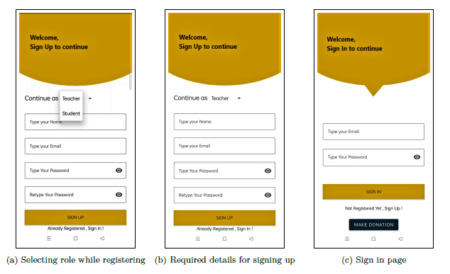</td>
  </tr>
</table>

<table>
  <tr>
    <td>Sign In</td>
  </tr>
  <tr>
    <td>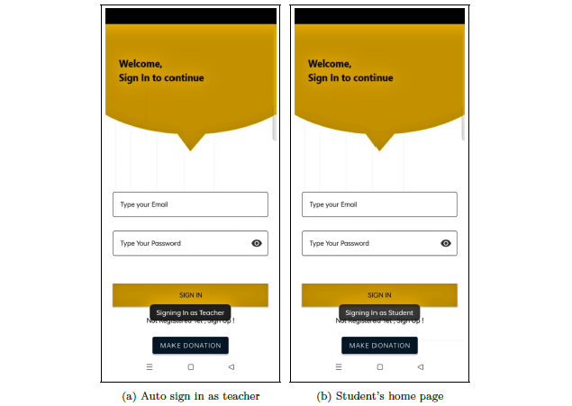</td>
  </tr>
</table>

<table>
  <tr>
    <td>Different Home Pages for Teacher & Student</td>
  </tr>
  <tr>
    <td>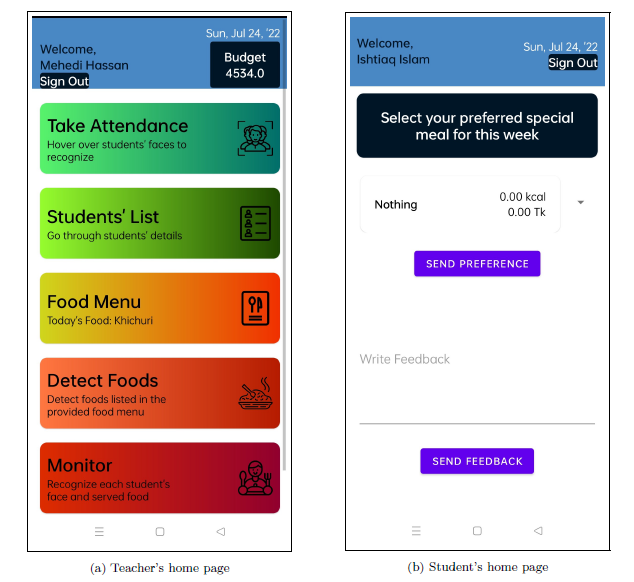</td>
  </tr>
</table>

<table>
  <tr>
    <td>Taking Daily Attendance - 1</td>
  </tr>
  <tr>
    <td>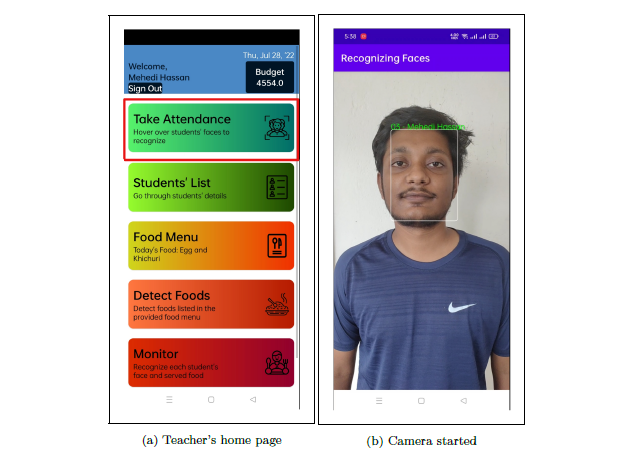</td>
  </tr>
</table>

<table>
  <tr>
    <td>Taking Daily Attendance - 2</td>
  </tr>
  <tr>
    <td>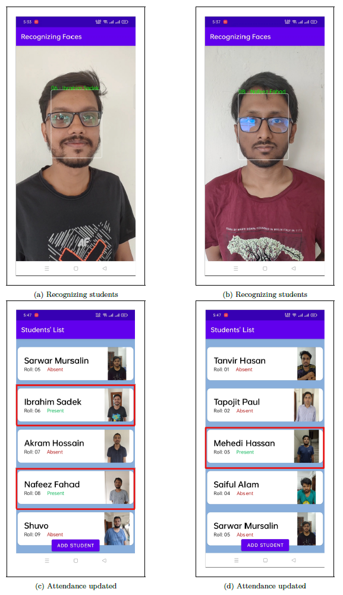</td>
  </tr>
</table>

<table>
  <tr>
    <td>Students' List</td>
  </tr>
  <tr>
    <td>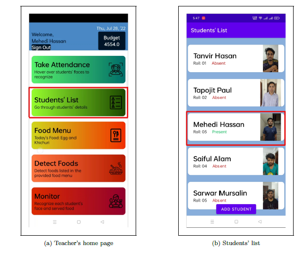</td>
  </tr>
</table>

<table>
  <tr>
    <td>Student Details</td>
  </tr>
  <tr>
    <td>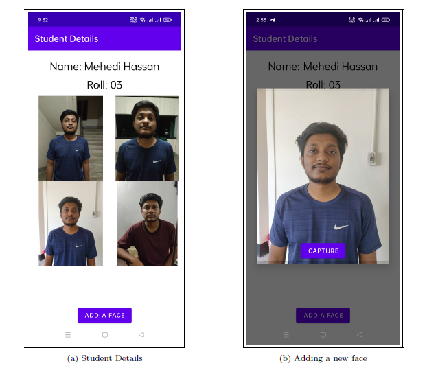</td>
  </tr>
</table>

<table>
  <tr>
    <td>Daily Meal Suggestion</td>
  </tr>
  <tr>
    <td>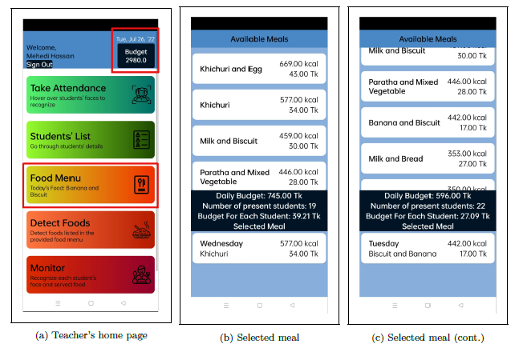</td>
  </tr>
</table>

<table>
  <tr>
    <td>Check if prepared food ca be recognized</td>
  </tr>
  <tr>
    <td>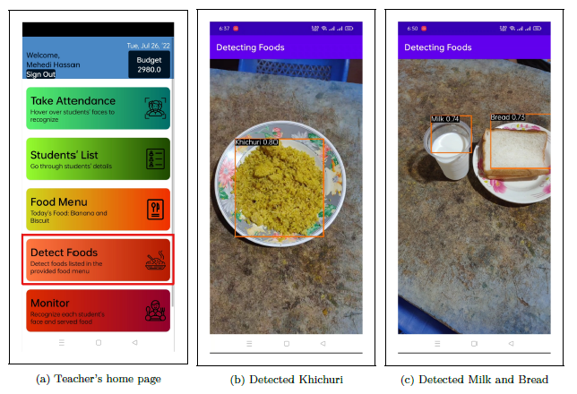</td>
  </tr>
</table>

<table>
  <tr>
    <td>Monitoring after Serving Food - Face Recognition</td>
  </tr>
  <tr>
    <td>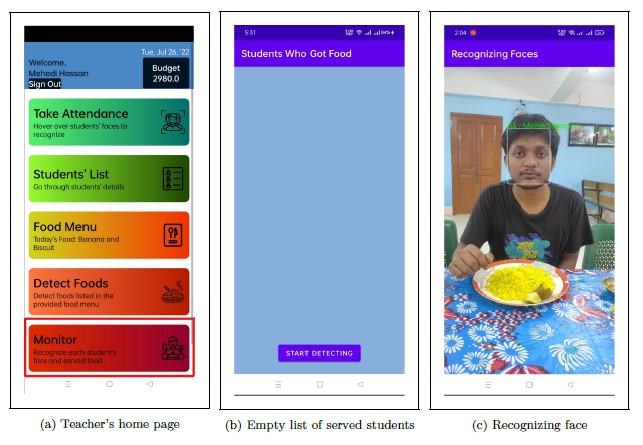</td>
  </tr>
</table>

<table>
  <tr>
    <td>Monitoring after Serving Food - Food Recognition</td>
  </tr>
  <tr>
    <td>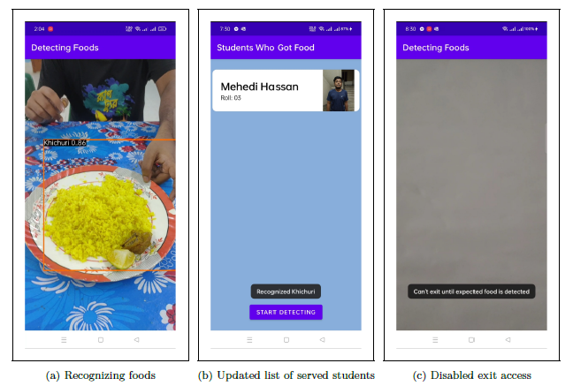</td>
  </tr>
</table>

<table>
  <tr>
    <td>Sending Report from Dashboard</td>
  </tr>
  <tr>
    <td>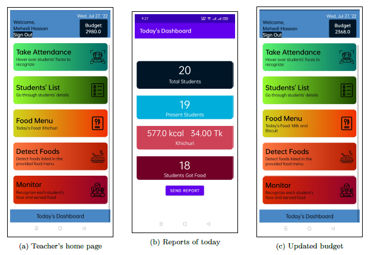</td>
  </tr>
</table>

<table>
  <tr>
    <td>Stored reports in database</td>
  </tr>
  <tr>
    <td>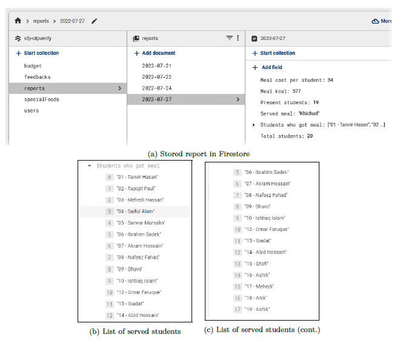</td>
  </tr>
</table>

<table>
  <tr>
    <td>Taking student's food preference after logging in as student</td>
  </tr>
  <tr>
    <td>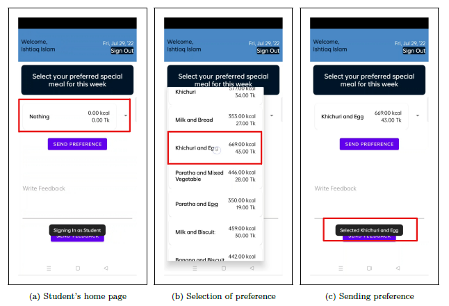</td>
  </tr>
</table>

<table>
  <tr>
    <td>Taking overall feedback</td>
  </tr>
  <tr>
    <td>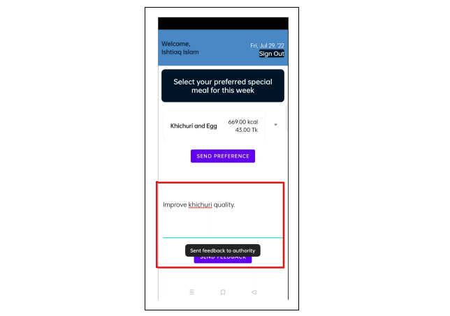</td>
  </tr>
</table>
